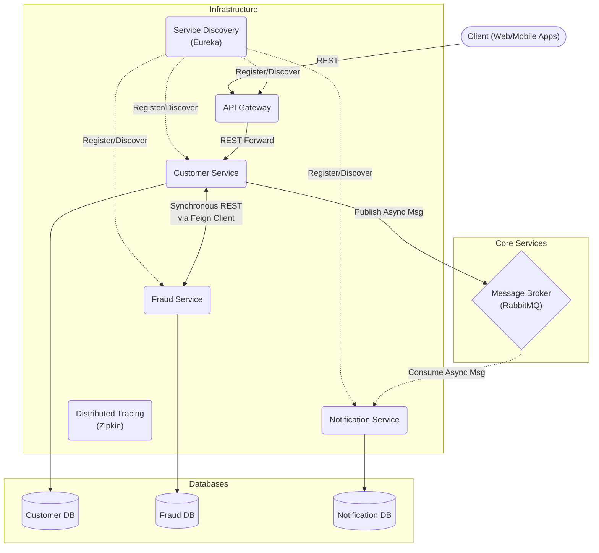

# High-Level Design (HLD): Microservices Architecture

## System Overview

The **Amigosservices** project is a distributed backend application built entirely on a modern **Spring Boot & Spring Cloud** technology stack. The system is designed to provide core functionalities—such as managing customers, evaluating fraudulent behaviors, and handling messaging workflows—by decomposing responsibilities into isolated, independently deployable microservices. 

It heavily leverages a hybrid communication style, utilizing synchronous REST calls for critical path validations and asynchronous event-driven queues for non-blocking secondary processes.

## Architecture Description

The architecture follows a classical **Microservices** and **Event-Driven** approach. 

- **Layered Topology**: A dedicated API Gateway acts as the entry interface, shielding internal services from clients.
- **Hybrid Communication**:
  - **Synchronous (REST)** is primarily conducted edge-to-service (via Gateway) or service-to-service when immediate validation is strictly required (e.g., verifying fraud during registration). Service locations are abstracted away using Service Discovery (Eureka Server) and called using declarative REST clients (`OpenFeign`).
  - **Asynchronous (AMQP)** is handled by a RabbitMQ message broker. It enables loosely coupled background processing that improves performance and reliability (e.g., dispatching notifications asynchronously).
- **Decentralized Data Management**: Each core microservice commands its own database schema (`customer`, `fraud`, `notification`), avoiding coupling at the data store level.

## Architecture Diagram

## Key Components Explanation

1. **API Gateway (`apigw`)**: The singular entry point into the system. It abstracts backend complexity and provides centralized policy enforcement, routing external API requests to appropriate internal microservices based on paths.
2. **Service Discovery (`eureka-server`)**: Tracks the network locations of available microservice instances. This eliminates the need for hardcoded IP addresses, allowing for seamless horizontal scaling.
3. **Customer Service (`customer`)**: The core domain service. It manages customer profile creation and handles the primary business orchestration when a user onboard to the platform.
4. **Fraud Service (`fraud`)**: Isolates the domain responsibility of analyzing users and assessing them for fraudulent flags. Retains historical auditing records of all fraud checks.
5. **Notification Service (`notification`)**: The messaging domain. It listens to RabbitMQ queues in the background and is responsible for dispatching communications (e.g., emails/SMS messages) out to customers based on system triggers.
6. **RabbitMQ**: Enterprise message broker that decouples services. It maintains the message queues to buffer notifications produced by the `customer` service until `notification` is ready to consume them.
7. **Zipkin / Tracing**: An observability component that visualizes request traces traversing through microservices. Very useful to diagnose latencies and connection issues.

## Data Flow Example: Customer Registration

This is the primary workflow showcasing the orchestration between sync and async processes:

1. **Ingress**: The Client sends a `POST /api/v1/customers` request.
2. **Gateway**: The **API Gateway** intercepts the request, maps the route to the **Customer Service**, asks **Eureka** for an available Customer instance's IP, and routes the traffic.
3. **Persistence**: **Customer Service** creates a prospective user record and immediately persists the data down into its local **Customer Database**. 
4. **Synchronous Validation**: The **Customer Service** blocks the transaction and reaches out to the **Fraud Service** (using its Feign client capability) to evaluate the new user identity. 
5. **Evaluation**: **Fraud Service** performs its internal checks, saves an audit trail to the **Fraud Database**, and responds `false` (not a fraudster) back over the wire.
6. **Asynchronous Hand-off**: Knowing the customer is legitimate, the **Customer Service** publishes a `NotificationRequest` message to the `internal.exchange` inside **RabbitMQ** to welcome the user.
7. **Egress**: The **Customer Service** acknowledges success back to the Gateway, which returns `200 OK` to the Client.
8. **Worker Consumption**: In parallel, the **Notification Service** picks up the queued message from **RabbitMQ**, constructs the welcome template, sends it, and securely logs the notification record in the **Notification Database**.

## Scalability and Fault Tolerance

- **Client-Side Load Balancing**: Synchronous internal calls made over Feign clients are inherently load-balanced. If three `fraud` service instances are active, requests from `customer` are balanced between them sequentially.
- **Dynamic Auto-Scaling**: Thanks to **Eureka**, any failing services that crash are deregistered, keeping traffic away from broken containers. New instances spun up will automatically wire themselves into the ecosystem.
- **Fault Tolerance via Async**: Using **RabbitMQ** provides buffering. If the **Notification Service** experiences an outage or a spike, the API response given to the registering user isn't delayed. The messages simply sit safely in the queue until the service scales to process them. 
- **Tracing**: Implementing **Zipkin** ensures that timeouts and circular failures can be correlated under a single Trace ID, providing deep traceability across a decoupled application context.
