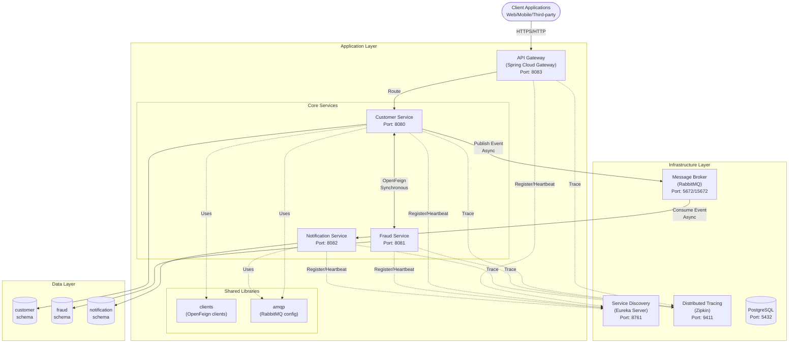
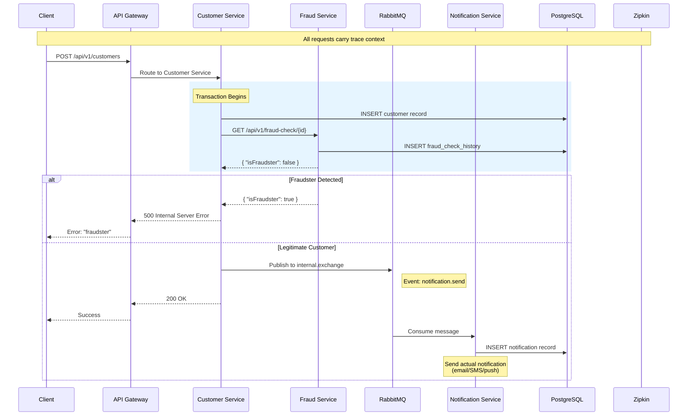

# Amigosservices: Microservices Architecture

## Table of Contents
1. [Executive Summary](#executive-summary)
2. [Architecture Overview](#architecture-overview)
3. [Component Breakdown](#component-breakdown)
4. [Data Flow](#data-flow)
5. [Communication Patterns](#communication-patterns)
6. [Data Management](#data-management)
7. [Observability](#observability)
8. [Deployment Architecture](#deployment-architecture)

---

## Executive Summary

Amigosservices is a production-ready microservices reference architecture demonstrating modern distributed system patterns. Built on **Spring Boot 2.5.7** and **Spring Cloud 2020.0.3**, it showcases:

- **Synchronous** service-to-service communication via OpenFeign
- **Asynchronous** event-driven architecture via RabbitMQ
- **Service discovery** and client-side load balancing via Netflix Eureka
- **Distributed tracing** via Zipkin
- **API Gateway** pattern for unified ingress
- **Database-per-service** pattern with PostgreSQL

This architecture serves as a blueprint for building scalable, resilient, and observable microservices on the JVM.

---

## Architecture Overview

### System Topology



### Key Design Principles

| Principle | Implementation |
|-----------|---------------|
| **Single Responsibility** | Each service owns one business capability |
| ** loose Coupling** | Async messaging via RabbitMQ; sync via service discovery |
| **High Cohesion** | Related functionality colocated within services |
| **Fault Isolation** | Circuit breaker patterns; async decoupling |
| **Observability** | Distributed tracing; centralized logging ready |

---

## Component Breakdown

### Infrastructure Components

| Component | Technology | Purpose | Port |
|-----------|-----------|---------|------|
| **API Gateway** | Spring Cloud Gateway | Single entry point; routing; cross-cutting concerns | 8083 |
| **Service Discovery** | Netflix Eureka | Dynamic service registration and discovery | 8761 |
| **Message Broker** | RabbitMQ | Async event distribution; decoupling | 5672 (AMQP), 15672 (Management) |
| **Distributed Tracing** | Zipkin | Request tracing across services | 9411 |
| **Database** | PostgreSQL | Persistent storage (schema-per-service) | 5432 |

### Core Services

| Service | Responsibility | Key Dependencies |
|---------|---------------|------------------|
| **Customer Service** | Customer registration; orchestrates onboarding workflow | Fraud Service (sync), RabbitMQ (async) |
| **Fraud Service** | Fraud risk assessment; maintains audit history | Database only |
| **Notification Service** | Message dispatching; AMQP consumer | RabbitMQ (consumer), Database |

### Shared Libraries

| Library | Purpose | Consumers |
|---------|---------|-----------|
| **clients** | OpenFeign client interfaces for inter-service calls | Customer Service |
| **amqp** | RabbitMQ configuration, exchanges, queues | Customer Service, Notification Service |

---

## Data Flow

### Primary Flow: Customer Registration



### Flow Characteristics

| Aspect | Implementation |
|--------|---------------|
| **Synchronous Block** | Customer creation + Fraud check (blocking) |
| **Asynchronous Handoff** | Notification dispatch (non-blocking) |
| **Transaction Scope** | Customer DB write; no distributed transaction |
| **Compensation** | None implemented; fraud check prevents notification |
| **Eventual Consistency** | Notification delivery is eventually consistent |

---

## Communication Patterns

### Synchronous Communication (REST)

```
┌─────────────────┐         ┌─────────────────┐
│ Customer Service│ ──────> │  Fraud Service  │
│   (Feign Client)│ <────── │  (REST Endpoint)│
└─────────────────┘  HTTP   └─────────────────┘
       │                           │
       └────── Eureka Lookup ──────┘
```

**Characteristics:**
- **Protocol**: HTTP/1.1 via OpenFeign
- **Discovery**: Client-side load balancing via Eureka
- **Timeout**: Default Feign timeouts apply
- **Retry**: No automatic retry configured
- **Circuit Breaker**: Not implemented (potential enhancement)

### Asynchronous Communication (AMQP)

```
┌─────────────────┐    Publish     ┌─────────────┐    Consume    ┌─────────────────┐
│ Customer Service│ ─────────────> │internal.    │ ────────────> │Notification     │
│                 │                │  exchange   │               │    Service      │
└─────────────────┘                └─────────────┘               └─────────────────┘
```

**Exchange Configuration:**
- **Exchange Name**: `internal.exchange`
- **Type**: Topic (configurable)
- **Routing Key**: `internal.notification.routing-key`
- **Queue**: `internal.notification`
- **Durability**: Durable exchange and queue

---

## Data Management

### Database Architecture

| Service | Schema | Tables |
|---------|--------|--------|
| Customer | `customer` | `customer` |
| Fraud | `fraud` | `fraud_check_history` |
| Notification | `notification` | `notification` |

### Data Consistency Model

```
┌─────────────────────────────────────────────────────────────┐
│                     Customer Registration                    │
├─────────────────────────────────────────────────────────────┤
│                                                              │
│  ┌──────────────┐  ┌──────────────┐  ┌──────────────┐       │
│  │   Customer   │  │    Fraud     │  │ Notification │       │
│  │   Record     │  │   Check      │  │   Event      │       │
│  └──────────────┘  └──────────────┘  └──────────────┘       │
│         │                │                │                 │
│         ▼                ▼                ▼                 │
│    Strong Consistency  Sync Validation  Eventual            │
│    (Immediate)         (Blocking)       Consistency         │
│                                         (Async)             │
│                                                              │
└─────────────────────────────────────────────────────────────┘
```

---

## Observability

### Distributed Tracing

Zipkin traces capture the following spans:

1. **API Gateway** → Incoming request
2. **Customer Service** → Processing
3. **Customer Service** → Database operation
4. **Customer Service** → Fraud Service call (Feign)
5. **Fraud Service** → Processing
6. **Fraud Service** → Database operation
7. **RabbitMQ** → Message publish (if success)

### Health Endpoints

All services expose Spring Boot Actuator health endpoints:

```
GET /actuator/health          # Overall health
GET /actuator/health/liveness  # Kubernetes liveness probe
GET /actuator/health/readiness # Kubernetes readiness probe
```

---

## Deployment Architecture

### Docker Compose Topology

```yaml
# Infrastructure (Start First)
- postgres       # Database with 3 schemas
- rabbitmq       # Message broker
- zipkin         # Tracing server

# Services (Start in Order)
- eureka-server  # Must be healthy first
- apigw          # Depends on eureka
- fraud          # Depends on postgres
- customer       # Depends on postgres, rabbitmq, eureka
- notification   # Depends on postgres, rabbitmq
```

### Spring Profiles

| Profile | Purpose | Configuration |
|---------|---------|---------------|
| `default` | Local IDE development | `localhost` URLs |
| `docker` | Containerized deployment | Service names as hosts |
| `kube` | Kubernetes deployment | ConfigMaps/Secrets ready |

---

## Scalability & Fault Tolerance

### Horizontal Scaling

| Component | Stateless? | Scaling Mechanism |
|-----------|-----------|-------------------|
| API Gateway | ✅ Yes | Multiple instances behind LB |
| Customer Service | ✅ Yes | Register multiple instances with Eureka |
| Fraud Service | ✅ Yes | Register multiple instances with Eureka |
| Notification Service | ✅ Yes | Competing consumer pattern |
| Eureka Server | ⚠️ Clustered | Peer-to-peer replication |
| RabbitMQ | ⚠️ Clustered | Mirrored queues |
| PostgreSQL | ❌ No | Primary-replica (not configured) |

### Fault Tolerance Patterns

| Pattern | Implementation | Status |
|---------|---------------|--------|
| **Client-Side Load Balancing** | Netflix Ribbon (via Feign) | ✅ Implemented |
| **Service Discovery** | Netflix Eureka | ✅ Implemented |
| **Async Decoupling** | RabbitMQ | ✅ Implemented |
| **Circuit Breaker** | Resilience4j | ⚠️ Not implemented |
| **Retry with Backoff** | Spring Retry | ⚠️ Not implemented |
| **Rate Limiting** | Gateway filters | ⚠️ Not implemented |

---

## Future Enhancements

1. **Resilience Patterns**: Implement circuit breakers (Resilience4j) for fraud service calls
2. **API Versioning**: Add versioning strategy to API Gateway routes
3. **Authentication**: Integrate OAuth2/JWT at API Gateway level
4. **Rate Limiting**: Implement request throttling per client
5. **Event Sourcing**: Consider event sourcing for customer lifecycle
6. **Saga Pattern**: Implement proper distributed transaction compensation
7. **Caching**: Add Redis for frequently accessed fraud check results
8. **Monitoring**: Integrate Prometheus/Grafana for metrics
